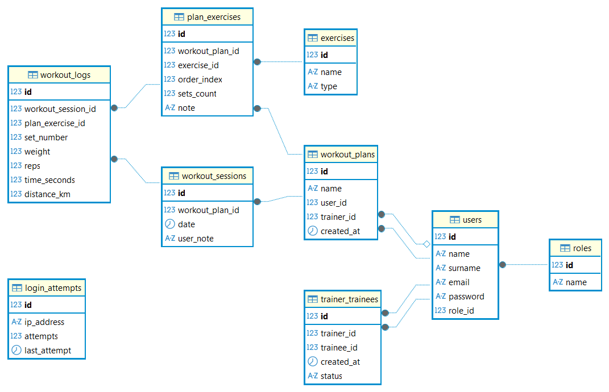

# FitTrack

Aplikacja internetowa typu MVC stworzona w czystym PHP, służąca do zarządzania relacjami trener-podopieczny oraz planami treningowymi. Projekt zrealizowany w ramach przedmiotu Wstęp do Projektowania Aplikacji Internetowych na Politechnice Krakowskiej.

## 📋 O projekcie

Celem projektu było stworzenie platformy umożliwiającej trenerom personalnym efektywne zarządzanie swoimi podopiecznymi. Aplikacja pozwala na tworzenie spersonalizowanych planów treningowych, przypisywanie ich do użytkowników oraz monitorowanie postępów. System oparty jest na rolach użytkowników, zapewniając odpowiedni poziom dostępu do funkcjonalności.

Aplikacja została zbudowana zgodnie ze wzorcem projektowym **MVC (Model-View-Controller)**, kładąc duży nacisk na programowanie obiektowe (OOP), czystość kodu oraz bezpieczeństwo.

### Główne funkcjonalności

**Dla wszystkich użytkowników:**
* Bezpieczna rejestracja i logowanie (hashowanie haseł Bcrypt).
* Ochrona przed atakami brute-force na panel logowania.
* Bezpieczne zarządzanie sesją (HttpOnly, Secure cookies).

**Rola: Trener (Trainer):**
* Dostęp do dedykowanego panelu (dashboard).
* Zarządzanie listą podopiecznych (dodawanie, przeglądanie).
* Tworzenie i edycja planów treningowych (dodawanie ćwiczeń, serii, notatek).
* Podgląd szczegółów i postępów przypisanych podopiecznych.

**Rola: Podopieczny (Trainee):**
* Dostęp do panelu z przypisanymi planami treningowymi.
* Możliwość "rozpoczęcia treningu" i logowania wyników sesji treningowej.

## 🛠️ Technologie

Projekt został zrealizowany przy użyciu następujących technologii:

* **Backend:** PHP 8.x (Native MVC, OOP, PDO)
* **Baza danych:** PostgreSQL
* **Frontend:** HTML, CSS, JavaScript
* **Środowisko:** Docker & Docker Compose

## ⚙️ Instalacja i uruchomienie

Projekt wykorzystuje konteneryzację Docker, co znacznie upraszcza proces uruchomienia.

### Wymagania wstępne
* Zainstalowany Docker oraz Docker Compose na komputerze lokalnym.

### Kroki instalacji

1.  **Sklonuj repozytorium:**
    ```bash
    git clone https://github.com/GaskaPiotr/WdPAI_2025
    ```

2.  **Uruchom kontenery:**
    W głównym katalogu projektu (tam, gdzie znajduje się plik `docker-compose.yml`) wykonaj polecenie:
    ```bash
    docker-compose up -d
    ```

3.  **Inicjalizacja bazy danych:**
    Baza danych PostgreSQL powinna zostać automatycznie utworzona i zasilona danymi startowymi (struktura tabel, role, przykładowi użytkownicy) na podstawie pliku `init.sql` (lub podobnego) znajdującego się w projekcie.

4.  **Dostęp do aplikacji:**
    Po poprawnym uruchomieniu kontenerów, aplikacja jest dostępna pod adresem:
    `http://localhost:8080`

## 🗂️ Struktura Bazy Danych (ERD)

Poniższy diagram przedstawia relacje między tabelami w bazie danych PostgreSQL.



Kluczowe tabele:
* `users`: Przechowuje dane logowania i dane osobowe.
* `roles`: Definiuje role w systemie (Trainer, Trainee, Admin).
* `trainer_trainees`: Tabela łącząca (relacja wiele-do-wielu), definiująca kto jest czyim podopiecznym.
* `plans`: Nagłówki planów treningowych.
* `exercises`: Konkretne ćwiczenia wchodzące w skład planu.

## 🛡️ Bezpieczeństwo

W projekcie zastosowano szereg dobrych praktyk związanych z bezpieczeństwem aplikacji webowych:

* **Architektura MVC:** Separacja logiki biznesowej od widoku.
* **Wzorzec DTO (Data Transfer Object):** Wrażliwe dane (np. hasła) nigdy nie są przekazywane do widoku.
* **Prepared Statements (PDO):** Pełna ochrona przed atakami SQL Injection.
* **Walidacja danych wejściowych:** Wszystkie dane z formularzy są sprawdzane pod kątem typu i długości.
* **Bezpieczne sesje:** Ciasteczka sesyjne z flagami `HttpOnly` oraz `SameSite=Strict` w celu ochrony przed XSS i CSRF.
* **Obsługa błędów:** Użytkownik końcowy nie widzi systemowych komunikatów błędów (np. "Fatal Error"), a jedynie estetyczne strony błędów 404/403/500 z odpowiednimi kodami HTTP.

## 👤 Autor

Piotr Gąska